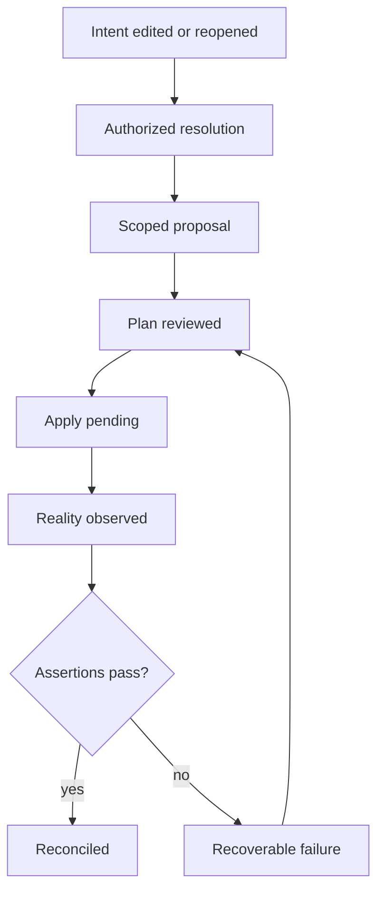
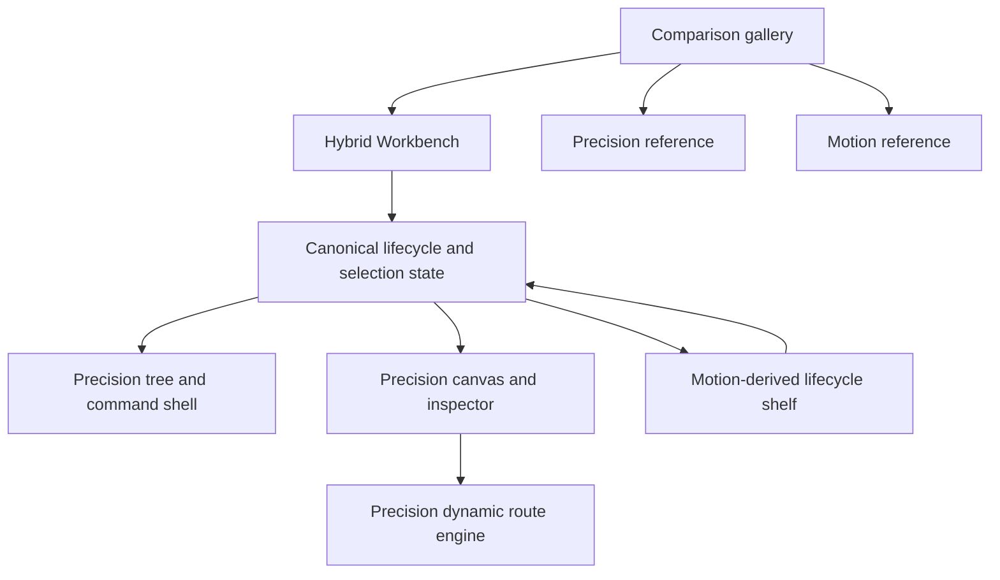

# Clockwork Workbench Stateful Canvas Prototypes - Plan

## Goal Capsule

- **Objective:** Deliver one recommended Clockwork Workbench that combines Precision’s operating shell with Motion’s lifecycle/state experience while preserving both source alternatives for comparison.
- **Means:** Add a tracked hybrid prototype, make it the gallery default, and retain one shared lifecycle, semantic model, routing contract, viewport, and reset contract across all three surfaces.
- **Product authority:** `PRODUCT.md` defines Clockwork’s source-of-truth, provenance, graph, composite, and lifecycle rules; this Product Contract defines the Workbench prototype and hybrid comparison.
- **Open blockers:** None. The hybrid-default gallery shape is user-approved.

---

## Product Contract

### Summary

Build a recommended dark-mode hybrid that uses Precision Workbench as the persistent operating shell and Motion Compiler as the source for a collapsible lifecycle/evidence surface and physical spatial feedback. Keep Precision and Motion as reference tabs under the same fixed viewport, state, and interaction contract.

### Problem Frame

Dense semantic graphs become difficult to read when several edges cross or overlap. Later mockups also lost comparability through inconsistent viewport scaling, reduced interaction depth, and lower visual finish.

The prototypes must test Clockwork’s real product premise rather than static dashboard composition: source-backed intent, authorized resolution, scoped proposals, materialized reality, assertions, drift, and reversible composite navigation.

### Key Decisions

- **Hybrid edge readability model** (session-settled: user-directed — chosen over railway trunks, typed buses, focus isolation, or relationship planes alone: stable railway geometry, local focus, and overload filtering solve different density levels). Governs R4–R6.
- **Overview-first interaction hierarchy** (session-settled: user-directed — chosen over lens-first, equal top-level modes, or a reduced mechanism set: the graph remains legible while deeper tools appear on demand). Governs R7–R10.
- **Complete intent-to-reality simulation** (session-settled: user-directed — chosen over proposal-only or topology-only flows: the prototype must exercise Clockwork’s durable lifecycle advantage). Governs R11–R15.
- **Happy path plus one recoverable failure** (session-settled: user-directed — chosen over happy-path-only or an exhaustive failure matrix: one failure is enough to evaluate explanation and recovery without overwhelming comparison). Governs R16.
- **Hybrid default with two references** (session-settled: user-directed — chosen over replacing the originals or leaving Precision as default: the user wants the 70% Precision / 30% Motion recommendation implemented while retaining both references). Governs R1–R3, R23.
- **Standardized 1280×720 artboard at 90% presentation scale** (session-settled: user-approved — chosen over per-screen auto-fit: it restores the first mockups’ visual convention with approximately 10% more context). Governs R2–R3.
- **First/second-iteration polish is the minimum finish** (session-settled: user-directed — chosen over rough direction-board fidelity: mockups must be judged as products, not sketches). Governs R17–R20.
- **Clockwork Workbench is the canonical surface name** (session-settled: user-directed — chosen to unify “Clockwork UI” and “Clockwork Workbench” as the same product surface). Governs R1.
- **Canvas primitives are directly movable** (session-settled: user-directed — chosen over fixed auto-layout-only placement: the Workbench must support spatial manipulation while preserving semantics). Governs R22.

### Actors

- A1. **Primitive builder:** Authors application intent, inspects intelligent decisions, reviews changes, applies a plan, and diagnoses reality.
- A2. **Clockwork resolver:** Resolves only authorized ambiguity and records provenance, reasons, constraints, and rejected alternatives.
- A3. **Clockwork runtime simulator:** Produces deterministic backendless plan, apply, observation, assertion, failure, and recovery states for evaluation.

### Requirements

**Comparison contract**

- R1. Hybrid Workbench, Precision Workbench, and Motion Compiler must expose the same capabilities, synthetic data, lifecycle transitions, and failure scenario while differing in chrome, navigation, motion, and canvas UX; all default to dark mode.
- R2. Every alternative must use a fixed 1280×720 internal artboard and the same six-primitive photo-sharing scenario with seven typed semantic relationships.
- R3. The comparison surface must present each artboard at 90% scale without per-screen auto-fit, nested scaling, or different viewport conventions.

**Graph readability**

- R4. Stable relationships must follow orthogonal railway-style trunks with explicit switches, lane separation, and labels where routes merge or split.
- R5. Selecting a primitive, edge, or proposal must bring its relevant neighborhood to full contrast while keeping unrelated graph context visible but quiet.
- R6. Users must be able to toggle Calls, Data, Storage, and Jobs relationship planes without changing node positions; hidden cross-plane effects remain visible as counts or status marks.

**Canvas hierarchy and mechanisms**

- R7. The default state is a whole-system overview with a compact contextual inspector on selection.
- R8. Focus mode must open the semantic lens for the selected primitive without replacing or spatially rearranging the surrounding graph.
- R9. Intent, Resolution, and Reality controls must change the evidence displayed on stable nodes and edges without moving the topology.
- R10. Composite primitives must expand and collapse in place through semantic zoom; a collapsed composite preserves its source identity, internal count, external ports, health, assertions, and scoped proposals.

**Working lifecycle**

- R11. The backendless state model must simulate editing or reopening an intent field, authorizing resolution, and receiving a provenance-bearing resolved value.
- R12. Plan must produce a resource-level scoped diff and explicit create, update, delete, and assertion effects before Apply becomes available.
- R13. Apply must visibly progress through pending and completion states while keeping desired and observed values distinct.
- R14. Observe must update runtime health, identifiers, endpoints, versions, assertion evidence, and drift without erasing original intent or resolution reasoning.
- R15. Assert/Reconcile must close the loop by comparing observed reality against intent and making the next safe action explicit.
- R16. Each alternative must include one recoverable failure with a clear cause, retained state, retry or correction path, and reset to the shared starting scenario.

**Interaction quality and finish**

- R17. Every visible control must have a meaningful state change, including hover, focus, active, disabled, pending, success, and applicable error behavior.
- R18. Each alternative must have one coherent visual system with explicit typography, spacing, color, component, icon, and motion rules grounded in the approved reference directions.
- R19. Motion must communicate selection, spatial continuity, composite expansion, and lifecycle state; high-frequency and keyboard actions remain immediate, and reduced-motion users receive a non-spatial fallback.
- R20. Each alternative must pass a bounded visual-diff review with the available browser automation at the standardized viewport before it is shown for selection.
- R21. A mini-map or viewport locator, fit control, pan/zoom controls, visible keyboard focus, and source inspection must remain available in all alternatives.
- R22. Canvas primitives must be directly movable, with semantic routes updating continuously and preserving relation meaning after placement changes.
- R23. The gallery must default to a hybrid that uses Precision’s resource tree, canvas, inspector, source, commands, and route interaction while adding Motion’s collapsible lifecycle/evidence surface and physical state transitions; Precision and Motion remain selectable references.

### Key Flows

- F1. **Author and resolve intent**
  - **Trigger:** A1 selects `DB-03` and reopens `db.primary.major_version`.
  - **Actors:** A1, A2.
  - **Steps:** Inspect source and provenance, authorize the missing decision, compare PostgreSQL 19 with retained PostgreSQL 18 and rejected alternatives, then accept the scoped resolution.
  - **Outcome:** A provenance-bearing PostgreSQL 19 proposal exists without changing observed PostgreSQL 18.6.
  - **Covers:** R7–R12.

- F2. **Plan, apply, observe, and assert**
  - **Trigger:** A1 requests a plan for the accepted proposal.
  - **Actors:** A1, A3.
  - **Steps:** Review the resource-level diff, apply it, observe runtime evidence, run assertions, then reconcile drift or confirm success.
  - **Outcome:** The UI preserves intent, resolution, applied state, observed evidence, and assertion results as distinct lifecycle records.
  - **Covers:** R12–R15.

- F3. **Navigate topology without losing context**
  - **Trigger:** A1 investigates a primitive or dense relationship area.
  - **Actors:** A1.
  - **Steps:** Select a node or edge, isolate its neighborhood, toggle relationship planes, open Focus for deeper evidence, then expand or collapse a composite in place.
  - **Outcome:** The user can trace relevant paths and return to the whole-system overview without topology drift.
  - **Covers:** R4–R10, R21.

- F4. **Recover from failure**
  - **Trigger:** The simulated apply or assertion failure occurs.
  - **Actors:** A1, A3.
  - **Steps:** Inspect the cause and retained state, correct or retry the failed condition, observe success, then optionally reset the scenario.
  - **Outcome:** Recovery is understandable and does not silently discard authored or resolved decisions.
  - **Covers:** R16–R17.

### Acceptance Examples

- AE1. **Covers R4–R6.** Given all seven relationships are visible, when the builder selects `DB-03`, then the API and Worker database paths reach full contrast, railway switches and labels remain traceable, and unrelated edges stay visible but quiet.
- AE2. **Covers R8–R10.** Given `API-02` is a composite, when the builder collapses it, then one source-preserved summary retains its external ports, child count, health, assertions, and proposal count; expanding restores children at stable positions.
- AE3. **Covers R11–R15.** Given PostgreSQL 19 is accepted as a scoped resolution, when the builder plans and applies it, then desired state advances while observed PostgreSQL 18.6 remains distinct until Observe updates reality and assertions run.
- AE4. **Covers R16–R17.** Given the simulated backup-window assertion fails, when the builder reviews the evidence and retries after correction, then all prior intent and provenance remain available and the lifecycle advances to reconciled.
- AE5. **Covers R1–R3, R20.** Given the comparison gallery switches between alternatives, when the same scenario and lifecycle state are selected, then the data, capabilities, artboard dimensions, and 90% presentation scale remain identical.
- AE6. **Covers R22.** Given a builder drags `DB-03` or another primitive, when the primitive settles at its new position, then every attached semantic route redraws continuously and retains its relation family, direction, labels, and switch geometry.
- AE7. **Covers R23.** Given the gallery opens, when the default hybrid loads, then the Precision shell remains continuously usable while the Motion-derived state shelf presents and controls the same lifecycle without owning a second state machine.

### Success Criteria

- A builder can trace the selected primitive’s relevant relationships without following ambiguous crossings.
- A builder can reposition canvas primitives while their semantic routes remain attached and readable.
- Hybrid Workbench and both reference alternatives can complete the same lifecycle and recovery flow without dead controls or state mismatches.
- Composite navigation, semantic lens, evidence layers, and source inspection are discoverable within the overview-first hierarchy.
- The recommended hybrid feels like one product: Precision owns routine operation, while Motion’s state surface deepens lifecycle understanding without duplicating controls or state.
- The alternatives look and feel like finished products at the standardized viewport rather than rough diagrams or direction boards.
- The user can choose among alternatives based on UX and aesthetics rather than differences in feature completeness or zoom.

### Scope Boundaries

- Real Pulumi execution, network calls, persistence, authentication, collaboration, and production data are excluded from the prototype.
- Typed semantic buses are deferred as an escalation for graphs that exceed the selected hybrid edge model’s useful density.
- Exhaustive validation and failure matrices are deferred; one representative recoverable failure is required.
- Production framework, state architecture, and component implementation choices are deferred to planning.

### Dependencies and Assumptions

- `PRODUCT.md` remains the product authority for source inspectability, scoped intelligence, provenance, and application-architecture focus.
- Synthetic scenario data is acceptable when clearly labeled and identical across alternatives.
- The approved implementation direction is Hybrid Workbench as the default, with Precision Workbench and Motion Compiler retained as references; Direct Model Canvas remains retired.

### Sources and Research

- `PRODUCT.md`
- `README.md`
- `clockwork/cli.py`
- `clockwork/formatters.py`
- `prototypes/clockwork-workbench/`
- `docs/solutions/design-patterns/clockwork-workbench-prototype-direction.md`

---

## Planning Contract

**Product Contract preservation:** Changed R1 and added R23 to reflect the user-approved hybrid default; R2–R22 retain their meaning.

### Key Technical Decisions

- KTD1. **Hybrid uses one canonical fact snapshot and transition owner.** Derive the hybrid from `410-precision-working.html`, but replace compact stage strings with one snapshot containing lifecycle, pending action, desired and observed facts, proposal/update history, assertion results, selection, evidence, planes, node/view coordinates, disclosures, overlays, and shelf state. Every renderer consumes selectors over this snapshot. Governs R1, R7–R17, R23.
- KTD2. **Precision owns hybrid coordinates and route geometry.** Keep left/top node placement, `layoutDirty` reset, semantic relation IDs, rendered lane IDs, and `updateDynamicEdges` as the hybrid’s only geometry implementation. Motion’s data-x/transform geometry does not enter the hybrid. Governs R4–R6, R10, R21–R23.
- KTD3. **Motion’s shelf is a projection, not a state owner.** Port the lifecycle/evidence composition as a renderer and control surface over KTD1’s snapshot. Shelf disclosure changes presentation only. Governs R9, R11–R19, R23.
- KTD4. **Physical motion never moves hybrid route attachment boxes.** Use Motion’s spring personality on shelf disclosure and non-geometric descendants such as selection handles and composite content. Node left/top changes and composite outer bounds update routes immediately; do not animate outer node geometry. Governs R10, R17, R19, R22–R23.
- KTD5. **Hybrid becomes the gallery default** (session-settled: user-directed — chosen over replacing both references or leaving Precision first: the user wants the recommendation implemented and the source alternatives preserved). Add Hybrid as the first tab; preserve reference visual systems while allowing fact/reset parity repairs. Governs R1–R3, R23.
- KTD6. **Verification has two layers.** A tracked same-origin HTML harness proves deterministic dimensions, lifecycle, parity, disclosure, reset, and route data. Available real-browser automation proves trusted pointer/keyboard input, reduced motion, console errors, and screenshots. Governs R1–R23.
- KTD7. **The shelf has a fixed geometry and one action owner.** Open shelf height is 202px (38px header plus 164px body); collapsed height is 38px. The open shelf reserves space, leaving a 474px canvas. Hybrid-specific node positions fit that rectangle and never change on shelf disclosure. While open, the shelf action dock is the sole visible primary lifecycle action; when collapsed, Precision’s primary action returns. Governs R7–R23.
- KTD8. **Reset is cancellable and focus-safe.** The hybrid state owner retains a transition epoch or timer handle so Reset invalidates pending work before restoring the initial snapshot. Closed overlays and shelf bodies are hidden or inert; each close restores its invoker; Escape closes command menu, source drawer, semantic lens, then inspector, while the persistent shelf is controlled only by its disclosure button. Governs R11–R17, R21–R23.

### High-Level Technical Design

The hybrid has one mutable state owner. The tree, inspector, semantic lens, source drawer, canvas, lifecycle shelf, and gallery reset dispatch into that owner. The lower shelf renders Intent, Resolution, Reality, stage progression, assertions, and the current action; it does not maintain parallel lifecycle facts or timers.

### Assumptions

- The deliverable remains a self-contained static prototype with no backend or production framework migration.
- The hybrid uses a canonical seven-relation fixture and eight rendered lanes where the API→database relation splits into reads and writes.
- The lower shelf opens at 202px and collapses to 38px; the open state leaves a fixed 474px canvas and uses hybrid-specific initial node positions that fit that rectangle.
- Precision’s typography, 4/8 spacing, compact radii, one-pixel borders, icon family, dark surfaces, and cobalt selection define the hybrid visual system. Copper marks authorized lifecycle change; sage marks observed health or reconciliation. Gradients, decorative glow, ambient animation, gratuitous pills, and generic card grids are excluded.

### Risks and Mitigations

- **Duplicated state:** KTD1 requires one fact snapshot, one transition dispatcher, one pending timer/epoch, and selector-based projections.
- **Conflicting geometry:** KTD2 and KTD4 keep one left/top route model and forbid spring animation on outer node geometry.
- **Vertical crowding:** KTD7 fixes shelf and canvas dimensions and requires shelf-aware node/control bounds in both disclosure states.
- **Motion leakage:** Physical feedback is limited to low-frequency disclosure and non-geometric descendants; keyboard and routine controls remain immediate.
- **Reset gaps:** KTD8 cancels pending work before restoring lifecycle, layout, view, planes, evidence, disclosures, focus, and shelf state.
- **Reference drift:** U3 may repair count labels and reset adapters in Precision and Motion while preserving their visual and interaction identities.

### Sequencing

1. Establish the hybrid, canonical fact snapshot, transition cancellation, route ownership, and base contract harness.
2. Add the fixed-geometry lifecycle shelf, complete Hybrid contract/visual checks, and resolve all pre-gallery blockers.
3. Normalize reference parity, update the gallery to three columns, and make Hybrid the default.
4. Complete cross-surface verification, browser evidence, and durable guidance.

---

## Implementation Units

### U1. Create the Precision-derived hybrid shell

**Goal:** Create `430-hybrid-workbench.html` with Precision’s complete shell, canvas, state, routing, and interactions as the hybrid’s only behavior owner.

**Requirements:** R1–R17, R21–R22; F1–F4; AE1–AE4, AE6.

**Dependencies:** None.

**Files:**
- `prototypes/clockwork-workbench/430-hybrid-workbench.html` (new)
- `prototypes/clockwork-workbench/490-workbench-contract.html` (new test surface)

**Approach:**
1. Derive markup, dark tokens, resource tree, canvas, inspector, source drawer, command menu, mini-map, hooks, and dynamic routing from `410-precision-working.html`.
2. Define KTD1’s canonical fact snapshot and selector layer before building renderers; do not parse display strings or copy Motion’s lifecycle table.
3. Keep Precision’s left/top coordinates and route redraw per KTD2; add `Alt+Arrow` 8px and `Alt+Shift+Arrow` 24px keyboard movement through the same bounds, route, `layoutDirty`, live-region, and reset paths as pointer drag.
4. Add a reset operation that remains callable during pending work, invalidates the transition epoch/timer, restores every U1-owned transient state, and remains authored after waiting beyond the maximum pending duration.
5. Build the base contract harness for dimensions, hooks, canonical facts, lifecycle, routing, keyboard movement, disclosure, and reset before U2.

**Execution note:** Start with the contract harness loading the hybrid and proving initial dimensions, hooks, and reset before adding the Motion-derived shelf.

**Patterns to follow:**
- `prototypes/clockwork-workbench/410-precision-working.html`
- `docs/solutions/design-patterns/clockwork-workbench-prototype-direction.md`
- KTD1, KTD2, and KTD6

**Test scenarios:**
- Covers AE1. Select `DB-03`; API/Worker database routes remain readable while unrelated context quiets.
- Covers AE2. Expand and collapse `API-02`; child layout, summary, and attached routes remain valid.
- Covers AE3 / AE4. Run authored → reconciled, including pending states and the recoverable backup-window failure.
- Covers AE6. Drag and keyboard-move `DB-03` and `API-02`; route paths, switches, arrows, and unique labels update; Reset restores original layout.
- Start Apply, Reset immediately, wait beyond the maximum pending delay, and confirm lifecycle remains authored with no pending marker.
- Change Intent/Resolution/Reality and each relation plane; topology positions remain stable and hidden counts update.
- Open and dismiss inspector, source, semantic lens, and command menu; closed content is hidden/inert and focus returns to the invoker in the defined Escape order.

**Verification:** Hybrid renders at 1280×720 with a 474px open-shelf canvas budget, no overflow, one fact snapshot, one route owner, cancellable pending work, and a passing base contract harness.

### U2. Add the Motion-derived lifecycle shelf

**Goal:** Add a collapsible lower state/evidence compiler surface and physical spatial feedback to the hybrid without creating parallel state ownership.

**Requirements:** R9–R19, R22–R23; F1–F4; AE3–AE4, AE6–AE7.

**Dependencies:** U1.

**Files:**
- `prototypes/clockwork-workbench/430-hybrid-workbench.html`
- `prototypes/clockwork-workbench/490-workbench-contract.html`

**Approach:**
1. Adapt Motion’s lower-surface composition, evidence rail, stage progression, assertion meter, and action dock from `420-motion-working.html` into KTD7’s 202px reserved shelf.
2. Render every shelf value from KTD1 selectors. While open, the shelf dock is the sole visible primary lifecycle action and Precision’s lifecycle box is read-only; when collapsed, Precision’s primary action returns. Commands and keyboard shortcuts remain accelerators.
3. Add an `aria-controls`/`aria-expanded` shelf toggle. The collapsed shelf body is hidden or inert, focus moves to the toggle before collapse when necessary, and disclosure preserves lifecycle, evidence, selection, and node positions.
4. Use Precision’s typography, geometry, icons, and dark tokens. Copper is limited to authorized lifecycle change and sage to observed health/reconciliation. Keep evidence as one contiguous compiler rail.
5. Apply spring feedback only to the shelf and non-geometric descendants. Drag and composite outer geometry remain immediate with route redraw per KTD4; reduced motion removes spatial feedback.
6. Complete the Hybrid contract harness and five-state visual inspection before U3 changes the gallery default.

**Patterns to follow:**
- `prototypes/clockwork-workbench/420-motion-working.html`
- `prototypes/clockwork-workbench/410-precision-working.html`
- KTD3–KTD4

**Test scenarios:**
- Covers AE7. Shelf and upper shell show identical stage, counts, assertions, desired value, observed value, and next action at every lifecycle state.
- Trigger lifecycle actions from the shelf, commands, and collapsed Precision control; exactly one visible primary action exists and each input advances the same state once.
- Collapse and reopen the shelf at authored, proposed, failed, and reconciled stages; state and node geometry do not change, hidden content leaves tab order, and focus returns correctly.
- Switch evidence from the shelf; nodes, inspector, lens, source metadata, and shelf rail update from the same fact snapshot.
- Covers AE6 / R22. Drag and keyboard-move nodes before and after shelf disclosure; routes remain attached during input and correct after settle feedback.
- Verify immediate keyboard actions, reduced-motion non-spatial feedback, and every required rectangle inside the 474px open canvas and 638px collapsed canvas.

**Verification:** Hybrid parity, reset, routing, shelf, accessibility, and authored/proposed/failed/reconciled visual checks pass before gallery integration.

### U3. Make Hybrid the gallery default

**Goal:** Add Hybrid Workbench as the first/default comparison tab while preserving Precision and Motion as references.

**Requirements:** R1–R3, R20, R23; AE5, AE7.

**Dependencies:** U2.

**Files:**
- `prototypes/clockwork-workbench/401-working-gallery.html`
- `prototypes/clockwork-workbench/410-precision-working.html`
- `prototypes/clockwork-workbench/420-motion-working.html`
- `prototypes/clockwork-workbench/490-workbench-contract.html`

**Approach:**
1. Add the Hybrid tab first, change the tab grid from two to three columns, replace two-product THESIS/FORM copy, update the title map, and point the initial iframe source/title to `430-hybrid-workbench.html`.
2. Retain Precision and Motion visual/interaction identities, but normalize their shared fact/count labels to KTD1’s semantics where needed.
3. Keep the fixed 1280×720 iframe, 1152×648 wrapper, and 90% transform unchanged; verify all three tabs remain on one row inside the 76px header.
4. Make gallery Reset reload the active iframe for reference surfaces so every transient state clears. Hybrid may use its cancellable full reset before reload only when the harness proves equivalent postconditions.

**Patterns to follow:**
- `prototypes/clockwork-workbench/401-working-gallery.html`
- KTD5–KTD6

**Test scenarios:**
- Covers AE5. Gallery opens Hybrid at 90%; switching among all three preserves exact dimensions, canonical lifecycle facts, and scenario parity.
- Covers AE7. Hybrid is first/default; Precision and Motion remain accessible with their approved visual systems.
- Reset each surface after lifecycle progress, pending work, movement, pan/zoom, plane/evidence changes, composite disclosure, overlays, inspector use, and shelf changes; every surface returns to the same observable starting contract.
- Use keyboard tab navigation; all three tabs remain one row, active tab/title are accurate, and the header has no overflow.

**Verification:** Gallery integration occurs only after Hybrid’s U2 gate passes; all three surfaces then pass parity, full reset, fixed-scale, single-row tab, and source/title checks.

### U4. Complete the browser contract and durable guidance

**Goal:** Make the hybrid reproducible and verifiable for future sessions.

**Requirements:** R17–R23; all success criteria.

**Dependencies:** U1–U3.

**Files:**
- `prototypes/clockwork-workbench/490-workbench-contract.html`
- `docs/solutions/design-patterns/clockwork-workbench-prototype-direction.md`
- `docs/plans/2026-08-24-0455-feat-clockwork-stateful-canvas-prototypes-plan.md`

**Approach:**
1. Finish the same-origin HTML harness for deterministic lifecycle, parity, disclosure, reset, evidence, planes, relation IDs, dimensions, and final route data across all tracked surfaces.
2. Run a real-browser procedure for trusted pointer/keyboard movement, reduced-motion emulation, console/page errors, intermediate/final route attachment, focus behavior, and screenshots.
3. Update the durable learning with the verified hybrid composition, one-state/one-route-owner constraints, new paths, and any execution-time corrections.
4. Keep the plan’s Product Contract stable after implementation; documentation records verified behavior rather than progress state.

**Patterns to follow:**
- `docs/solutions/design-patterns/clockwork-workbench-prototype-direction.md`
- `CONCEPTS.md`
- KTD6

**Test scenarios:**
- Contract harness reports all deterministic hybrid and cross-surface parity checks as passing.
- Real-browser walkthrough captures authored, proposed, observed-drift, failed, recovered, and reconciled states with no console/page errors.
- Trusted pointer and keyboard input move nodes while routes remain attached; reduced-motion and focus/Escape behavior pass.
- Precision and Motion retain their approved visual identities after fact/reset parity repairs.

**Verification:** A future session can serve the tracked directory, run the deterministic harness and browser procedure, reproduce the hybrid lifecycle, and locate governing guidance without conversation history.

---

## Verification Contract

| Scope | Evidence |
|---|---|
| Static integrity | All tracked HTML files load from `prototypes/clockwork-workbench/` with no console errors or missing iframe sources. |
| Viewport parity | Hybrid, Precision, and Motion each report 1280×720 internally; the gallery wrapper reports 1152×648 at 90%. |
| Shared lifecycle | Contract harness reaches authored, unresolved, proposed, accepted, planned, applied, observed, failed, recovered, and reconciled with the expected desired/observed/assertion facts. |
| State ownership | Upper shell and lower shelf show identical lifecycle/evidence state; one action produces one transition and one pending interval. |
| Edge readability | All surfaces expose seven semantic relation IDs; Hybrid and Precision render eight lanes, Motion renders seven combined relations; labels, switches, arrows, and attachment remain correct through drag and composite resize. |
| Reset | Hybrid cancels pending work and restores every transient state; gallery reload restores equivalent starting postconditions for Precision and Motion. |
| Interaction/accessibility | Keyboard node movement, tab navigation, Escape LIFO closure, focus return, shelf disclosure/inert content, immediate keyboard actions, source/focus/fit/pan/zoom/minimap, and reduced-motion behavior work. |
| Visual quality | Hybrid direction block governs typography, spacing, geometry, color roles, icons, and motion; browser inspection covers authored/proposed/observed/failed/reconciled states before and after fixes. |

---

## Definition of Done

- U1 is done when the hybrid has Precision’s operating shell, one canonical fact snapshot and transition owner, one route owner, cancellable pending work, pointer/keyboard movement, U1-scope reset, and a passing base harness.
- U2 is done when the fixed-geometry Motion-derived shelf renders from the same snapshot, owns the single visible primary action while open, remains accessible/collapsible, and passes parity, routing, lifecycle, evidence, reduced-motion, and visual checks before gallery integration.
- U3 is done when the three-column gallery defaults to Hybrid, preserves the fixed scale, keeps both references visually intact, and restores the same starting contract on all three surfaces.
- U4 is done when deterministic and real-browser verification pass and the durable learning describes verified current behavior.
- The full lifecycle and recoverable failure pass in the hybrid with desired, resolved, and observed facts kept distinct.
- All required canvas mechanisms remain functional: selection focus, relation planes, semantic lens, composite expand/collapse, source, minimap, fit, pan/zoom, pointer/keyboard movement, shelf, and reset.
- No dead controls, console errors, broken paths, overflow, duplicate state/geometry owners, detached routes, hidden focus targets, duplicate primary actions, or abandoned experimental code remain.
