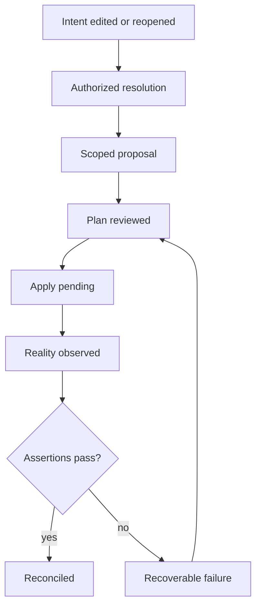

# Clockwork Workbench Stateful Canvas Prototypes - Plan

## Goal Capsule

- **Objective:** Let Clockwork’s builders compare two polished Clockwork Workbench directions through the same complete, interactive intent-to-reality workflow.
- **Means:** Build two backendless dark-mode prototypes with shared behavior and data, a standardized viewport, readable semantic relationships, restored composite and evidence-navigation mechanisms, and draggable canvas components.
- **Product authority:** `PRODUCT.md` defines Clockwork’s source-of-truth, provenance, graph, composite, and lifecycle rules; this Product Contract defines the Workbench prototype comparison.
- **Open blockers:** None. Precision Workbench and Motion Compiler remain the active alternatives.

---

## Product Contract

### Summary

Build two fully interactive dark-mode Clockwork Workbench alternatives that share one semantic model and lifecycle while differing materially in chrome, navigation, motion, and canvas interaction. Each alternative must restore the polish of the earliest mockups and remain comparable at one fixed viewport and zoom.

### Problem Frame

Dense semantic graphs become difficult to read when several edges cross or overlap. Later mockups also lost comparability through inconsistent viewport scaling, reduced interaction depth, and lower visual finish.

The prototypes must test Clockwork’s real product premise rather than static dashboard composition: source-backed intent, authorized resolution, scoped proposals, materialized reality, assertions, drift, and reversible composite navigation.

### Key Decisions

- **Hybrid edge readability model** (session-settled: user-directed — chosen over railway trunks, typed buses, focus isolation, or relationship planes alone: stable railway geometry, local focus, and overload filtering solve different density levels). Governs R4–R6.
- **Overview-first interaction hierarchy** (session-settled: user-directed — chosen over lens-first, equal top-level modes, or a reduced mechanism set: the graph remains legible while deeper tools appear on demand). Governs R7–R10.
- **Complete intent-to-reality simulation** (session-settled: user-directed — chosen over proposal-only or topology-only flows: the prototype must exercise Clockwork’s durable lifecycle advantage). Governs R11–R15.
- **Happy path plus one recoverable failure** (session-settled: user-directed — chosen over happy-path-only or an exhaustive failure matrix: one failure is enough to evaluate explanation and recovery without overwhelming comparison). Governs R16.
- **Two working alternatives** (session-settled: user-directed — chosen after reviewing all three prototypes: Precision Workbench and Motion Compiler best match the desired Workbench direction). Governs R1–R3.
- **Standardized 1280×720 artboard at 90% presentation scale** (session-settled: user-approved — chosen over per-screen auto-fit: it restores the first mockups’ visual convention with approximately 10% more context). Governs R2–R3.
- **First/second-iteration polish is the minimum finish** (session-settled: user-directed — chosen over rough direction-board fidelity: mockups must be judged as products, not sketches). Governs R17–R20.
- **Clockwork Workbench is the canonical surface name** (session-settled: user-directed — chosen to unify “Clockwork UI” and “Clockwork Workbench” as the same product surface). Governs R1.
- **Canvas primitives are directly movable** (session-settled: user-directed — chosen over fixed auto-layout-only placement: the Workbench must support spatial manipulation while preserving semantics). Governs R22.

### Actors

- A1. **Primitive builder:** Authors application intent, inspects intelligent decisions, reviews changes, applies a plan, and diagnoses reality.
- A2. **Clockwork resolver:** Resolves only authorized ambiguity and records provenance, reasons, constraints, and rejected alternatives.
- A3. **Clockwork runtime simulator:** Produces deterministic backendless plan, apply, observation, assertion, failure, and recovery states for evaluation.

### Requirements

**Comparison contract**

- R1. Precision Workbench and Motion Compiler must expose the same capabilities, synthetic data, lifecycle transitions, and failure scenario while differing in chrome, navigation, motion, and canvas UX; both default to dark mode.
- R2. Every alternative must use a fixed 1280×720 internal artboard and the same six-primitive photo-sharing scenario with seven typed semantic relationships.
- R3. The comparison surface must present each artboard at 90% scale without per-screen auto-fit, nested scaling, or different viewport conventions.

**Graph readability**

- R4. Stable relationships must follow orthogonal railway-style trunks with explicit switches, lane separation, and labels where routes merge or split.
- R5. Selecting a primitive, edge, or proposal must bring its relevant neighborhood to full contrast while keeping unrelated graph context visible but quiet.
- R6. Users must be able to toggle Calls, Data, Storage, and Jobs relationship planes without changing node positions; hidden cross-plane effects remain visible as counts or status marks.

**Canvas hierarchy and mechanisms**

- R7. The default state is a whole-system overview with a compact contextual inspector on selection.
- R8. Focus mode must open the semantic lens for the selected primitive without replacing or spatially rearranging the surrounding graph.
- R9. Intent, Resolution, and Reality controls must change the evidence displayed on stable nodes and edges without moving the topology.
- R10. Composite primitives must expand and collapse in place through semantic zoom; a collapsed composite preserves its source identity, internal count, external ports, health, assertions, and scoped proposals.

**Working lifecycle**

- R11. The backendless state model must simulate editing or reopening an intent field, authorizing resolution, and receiving a provenance-bearing resolved value.
- R12. Plan must produce a resource-level scoped diff and explicit create, update, delete, and assertion effects before Apply becomes available.
- R13. Apply must visibly progress through pending and completion states while keeping desired and observed values distinct.
- R14. Observe must update runtime health, identifiers, endpoints, versions, assertion evidence, and drift without erasing original intent or resolution reasoning.
- R15. Assert/Reconcile must close the loop by comparing observed reality against intent and making the next safe action explicit.
- R16. Each alternative must include one recoverable failure with a clear cause, retained state, retry or correction path, and reset to the shared starting scenario.

**Interaction quality and finish**

- R17. Every visible control must have a meaningful state change, including hover, focus, active, disabled, pending, success, and applicable error behavior.
- R18. Each alternative must have one coherent visual system with explicit typography, spacing, color, component, icon, and motion rules grounded in the approved reference directions.
- R19. Motion must communicate selection, spatial continuity, composite expansion, and lifecycle state; high-frequency and keyboard actions remain immediate, and reduced-motion users receive a non-spatial fallback.
- R20. Each alternative must pass a bounded visual-diff review in Orca’s built-in browser at the standardized viewport before it is shown for selection.
- R21. A mini-map or viewport locator, fit control, pan/zoom controls, visible keyboard focus, and source inspection must remain available in all alternatives.
- R22. Canvas primitives must be directly movable, with semantic routes updating continuously and preserving relation meaning after placement changes.

### Key Flows

- F1. **Author and resolve intent**
  - **Trigger:** A1 selects `DB-03` and reopens `db.primary.major_version`.
  - **Actors:** A1, A2.
  - **Steps:** Inspect source and current provenance; authorize the missing decision; compare PostgreSQL 19 with retained PostgreSQL 18 and rejected alternatives; accept the scoped resolution.
  - **Outcome:** A provenance-bearing PostgreSQL 19 proposal exists without changing observed PostgreSQL 18.6.
  - **Covers:** R7–R12.

- F2. **Plan, apply, observe, and assert**
  - **Trigger:** A1 requests a plan for the accepted proposal.
  - **Actors:** A1, A3.
  - **Steps:** Review resource-level diff; apply; observe runtime update; run assertions; reconcile drift or confirm success.
  - **Outcome:** The UI preserves intent, resolution, applied state, observed evidence, and assertion results as distinct lifecycle records.
  - **Covers:** R12–R15.

- F3. **Navigate topology without losing context**
  - **Trigger:** A1 investigates a primitive or dense relationship area.
  - **Actors:** A1.
  - **Steps:** Select a node or edge; isolate its neighborhood; toggle relationship planes; open Focus when deeper evidence is needed; expand or collapse a composite in place.
  - **Outcome:** The user can trace relevant paths and return to the whole-system overview without topology drift.
  - **Covers:** R4–R10, R21.

- F4. **Recover from failure**
  - **Trigger:** The simulated apply or assertion failure occurs.
  - **Actors:** A1, A3.
  - **Steps:** Inspect the cause and retained state; correct or retry; observe success; optionally reset the scenario.
  - **Outcome:** Recovery is understandable and does not silently discard authored or resolved decisions.
  - **Covers:** R16–R17.

### Acceptance Examples

- AE1. **Covers R4–R6.** Given all seven relationships are visible, when the builder selects `DB-03`, then the API and Worker database paths reach full contrast, railway switches and labels remain traceable, and unrelated edges stay visible but quiet.
- AE2. **Covers R8–R10.** Given `API-02` is a composite, when the builder collapses it, then one source-preserved summary retains its external ports, child count, health, assertions, and proposal count; expanding restores children at stable positions.
- AE3. **Covers R11–R15.** Given PostgreSQL 19 is accepted as a scoped resolution, when the builder plans and applies it, then desired state advances while observed PostgreSQL 18.6 remains distinct until Observe updates reality and assertions run.
- AE4. **Covers R16–R17.** Given the simulated backup-window assertion fails, when the builder reviews the evidence and retries after correction, then all prior intent and provenance remain available and the lifecycle advances to reconciled.
- AE5. **Covers R1–R3, R20.** Given the comparison gallery switches between alternatives, when the same scenario and lifecycle state are selected, then the data, capabilities, artboard dimensions, and 90% presentation scale remain identical.
- AE6. **Covers R22.** Given a builder drags `DB-03` or another primitive, when the primitive settles at its new position, then every attached semantic route redraws continuously and retains its relation family, direction, labels, and switch geometry.

### Success Criteria

- A builder can trace the selected primitive’s relevant relationships without following ambiguous crossings.
- A builder can reposition canvas primitives while their semantic routes remain attached and readable.
- Both alternatives can complete the same lifecycle and recovery flow without dead controls or state mismatches.
- Composite navigation, semantic lens, evidence layers, and source inspection are discoverable within the overview-first hierarchy.
- The alternatives look and feel like finished products at the standardized viewport rather than rough diagrams or direction boards.
- The user can choose among alternatives based on UX and aesthetics rather than differences in feature completeness or zoom.

### Scope Boundaries

- Real Pulumi execution, network calls, persistence, authentication, collaboration, and production data are excluded from the prototype.
- Typed semantic buses are deferred as an escalation for graphs that exceed the selected hybrid edge model’s useful density.
- Exhaustive validation and failure matrices are deferred; one representative recoverable failure is required.
- Production framework, state architecture, and component implementation choices are deferred to planning.

### Dependencies and Assumptions

- `PRODUCT.md` remains the product authority for source inspectability, scoped intelligence, provenance, and application-architecture focus.
- Synthetic scenario data is acceptable when clearly labeled and identical across alternatives.
- The approved reference directions are Precision Workbench and Motion Compiler; the Direct Model Canvas alternative is retired.

### Sources and Research

- `PRODUCT.md`
- `README.md`
- `clockwork/cli.py`
- `clockwork/formatters.py`
- `prototypes/clockwork-workbench/`
